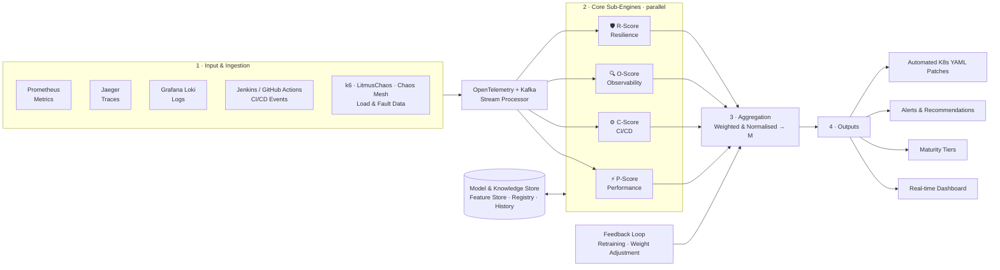

# 🧭 Microservices Maturity Assessment Framework

> **An Intelligent AI Framework for Multi-Dimensional Operational Maturity Assessment in Microservices**
> SLIIT · IT4010 Research Project 2026 Jul · Project ID **J26-SE-308** · Software Systems & Technologies (SE)


---

## 📌 Overview

Organisations running microservices lack a **structured, measurable** way to judge how mature their system really is. Existing tools (Datadog, Dynatrace, Prometheus, Chaos Mesh…) are **isolated**, reactive and threshold-based.

This framework continuously pulls live telemetry, scores four dimensions in parallel, and merges them into one **Maturity Score (M) from 0–100** — with tiers, alerts and AI-generated recommendations.

- ✅ 100% open-source stack
- ✅ Out-of-band & non-intrusive (decoupled from target apps)
- ✅ Vendor-neutral — reconfigure via one central YAML file
- ✅ Fully system-generated, empirical data (no external datasets)

---

## 🏗️ Architecture



---

## 🧩 The Four Sub-Engines

| Engine | Score | Focus | AI / Method | Novelty |
|---|---|---|---|---|
| ⚡ **Performance & Scalability** | **P** | CPU/RAM saturation, P95/P99 latency, RPS, HPA spin-up lag, call depth | Isolation Forest | **Intelligent Performance Anomaly & Drift Engine** — drift + fan-out + anomaly detection instead of static thresholds |
| ⚙️ **CI/CD & Automation** | **C** | Pipeline validation, progressive delivery, rollback loops | XGBoost / Random Forest | **Architecture-Aware CI/CD Maturity Engine** — 3 phases: Decoupling → Blast-Radius → Chaos-Rollout |
| 🔍 **Observability** | **O** | Metrics coverage, log integrity, trace-ID propagation | Scoring matrix + **Claude API** | **Cross-Pillar Log-Metric-Trace Correlation (CCI) Auditing** + GenAI root-cause & remediation guardrails |
| 🛡️ **Resilience & Fault Tolerance** | **R** | MTTR, availability, failover, error-budget burn | XGBoost / Random Forest | **AI-driven real-time resilience scoring with chaos validation** |

### 🎚️ Master Score & Maturity Tiers

`M = f(P, C, O, R)` — weighted, normalised aggregate on a 0–100 scale (weights adjustable via the feedback loop).

| M | Tier |
|---|---|
| 0 – 25 | 🔴 Initial |
| 26 – 50 | 🟠 Developing |
| 51 – 75 | 🔵 Mature |
| 76 – 100 | 🟢 Optimized |

> Engine-level tiers for C and R may also be expressed as Level 1–5.

---

## 🛡️ Built-in Safeguards (real-world gaps addressed)

| Problem in existing tools | How the framework handles it |
|---|---|
| HPA volatility → false alarms | Separates container spin-up bursts from true degradation |
| Polling "observer effect" | Lightweight, non-blocking async event-driven queries |
| Trace-sampling distortion | Sampling retention rate factored into score calibration |
| Black-box third-party deps | Treated as external, **non-penalised** variables |
| Stateless-only assumptions | Accounts for data replication, async queues (Kafka), REST vs gRPC |

---

## 📂 Repository Structure

```
.
├── core/                 # Maturity Evaluation Engine, aggregation (M), tiers
├── engines/
│   ├── performance/      # P-Score  — Go backend + Python pipeline (Isolation Forest)
│   ├── cicd/             # C-Score  — pipeline phases, XGBoost/RF
│   ├── observability/    # O-Score  — CCI auditing, Claude RCA & remediation
│   └── resilience/       # R-Score  — chaos orchestration, XGBoost/RF
├── ingestion/            # Prometheus / Jaeger / Loki / CI-CD collectors, Kafka, OTel
├── dashboard/            # UI + Grafana dashboards
├── k8s/                  # Sandbox cluster manifests, HPA, chaos experiments
├── loadtests/            # k6 / JMeter scenarios
├── config/config.yaml    # Central vendor-neutral configuration
├── tests/                # Unit · integration · chaos · load
└── README.md
```

> Adjust folder names to match your actual repo.

---

## ⚙️ Getting Started

### Prerequisites
- Docker + Kubernetes (minikube / kind / cloud sandbox)
- Prometheus · Jaeger · Grafana Loki · Grafana
- LitmusChaos or Chaos Mesh · k6
- Python 3.10+ · Go 1.22+ · Node.js (dashboard)
- Anthropic API key (Observability engine)

### Setup

```bash
git clone <your-repo-url> && cd <repo>

# configure endpoints & weights
cp config/config.example.yaml config/config.yaml
export ANTHROPIC_API_KEY=<your-key>

# deploy sandbox + telemetry stack
kubectl apply -f k8s/

# start engines & dashboard
docker compose up -d
```

---

## 🧪 Testing & Validation

| Level | Coverage |
|---|---|
| **Unit** | Model accuracy (synthetic/historical CSVs) · score boundary conditions · Claude API response |
| **Integration** | Telemetry → engines → dashboard · inject error → AI fix script |
| **Chaos** | Pod kill · CPU stress · network delay → MTTR, replica recreation, guardrails |
| **Load / Stress** | Steady vs peak traffic · HPA efficiency · breaking-point (500-errors) |
| **AI models** | Train/test split — accuracy, precision, recall |

---

## 📊 Data

Collected programmatically from a sandboxed Kubernetes environment: Prometheus Query API, Jaeger APIs, Loki HTTP API, LitmusChaos/Chaos Mesh, Jenkins Remote API / GitHub Actions — plus synthetic stress & chaos records.

---

## 🗺️ Roadmap

- [ ] Telemetry ingestion pipeline (Prometheus · Jaeger · Loki · CI/CD)
- [ ] P, C, O, R engines
- [ ] Master score aggregation + feedback loop
- [ ] Dashboard, alerts, maturity tiers
- [ ] Claude-powered RCA & YAML remediation with guardrails
- [ ] End-to-end validation on sandbox cluster

---

## 👥 Team

| Member | Reg. No | Component |
|---|---|---|
| ADIKARI A M K B | IT23241732 | ⚡ Performance & Scalability (P-Score) |
| JAYAWARDHANA J.K.C.T | IT23171992 | ⚙️ CI/CD Automation (C-Score) |
| EDIRISINHA E M G T | IT23243644 | 🔍 Observability (O-Score) |
| NUWANGA W A V | IT23360396 | 🛡️ Resilience (R-Score) |

**Supervisor:** Ms. Hansi De Silva
**Co-Supervisor:** Mr. Eishan Weerasinghe
**External Supervisor:** Mrs. Archchana Sindhujan

---

## 🌍 SDG Alignment

**SDG 9** Industry, Innovation & Infrastructure · **SDG 8** Decent Work & Economic Growth · **SDG 12** Responsible Consumption & Production

---

## 📄 License

Academic project — SLIIT. Add a license (e.g. MIT) if open-sourcing.
